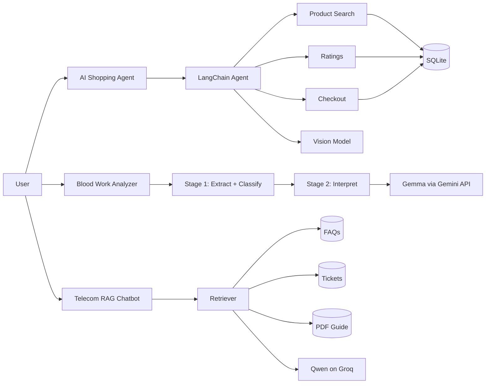
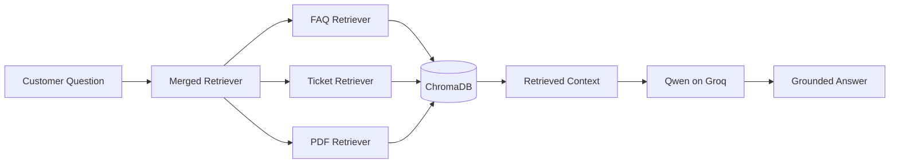

# Agentic AI Systems Portfolio

A portfolio index for the AI applications I built across agent orchestration,
multimodal search, staged LLM workflows, and retrieval-augmented generation.

The two primary applications now live in their own standalone repositories with
clean project structure, tests, architecture documentation, and public demos.

## Live projects

| Project | Live demo | Source | Focus |
| --- | --- | --- | --- |
| AI Shopping Agent | [Launch app](https://ai-shopping-agent-fvz8dpwpsfrihivomnkcz2.streamlit.app/) | [GitHub](https://github.com/chaitanya4595-afk/ai-shopping-agent) | Tool calling, multimodal search, transactional guardrails |
| Blood Work Analyzer | [Launch app](https://blood-work-analyzer-ajxxhudcgayqhcsinv7g9u.streamlit.app/) | [GitHub](https://github.com/chaitanya4595-afk/blood-work-analyzer) | Two-stage LLM pipeline, extraction, interpretation |

## Portfolio architecture



## 1. AI Shopping Agent

A conversational shopping system that accepts either a natural-language request
or an uploaded product image. The agent decides which tools to call, searches a
SQLite catalog, checks ratings, presents qualifying products, and only executes
checkout after explicit confirmation.

### Engineering decisions

- Kept search, ratings, and checkout as deterministic tools rather than model-owned business logic.
- Added a confirmation boundary before any order write.
- Preserved displayed product IDs so follow-up commands such as `order #2` resolve deterministically.
- Reused the same catalog-search flow for both text and image input.
- Added tests around the product catalog and rating aggregation.

**Stack:** Python · LangChain · Groq · Qwen · Llama 4 Scout · SQLite · Streamlit

[Repository](https://github.com/chaitanya4595-afk/ai-shopping-agent) · [Live demo](https://ai-shopping-agent-fvz8dpwpsfrihivomnkcz2.streamlit.app/)

## 2. Blood Work Analyzer

A staged LLM application that first extracts and classifies values from a blood
report, then passes the structured result into a second interpretation step for
a plain-language summary and practical diet guidance.

### Engineering decisions

- Split extraction and interpretation into separate model calls.
- Kept prompts and orchestration logic in separate modules.
- Added validation for blank input and malformed second-stage output.
- Made the model dependency injectable so the pipeline can be tested without external API calls.
- Kept the medical disclaimer explicit because model-generated interpretation can be wrong.

**Stack:** Python · LangChain · Gemini API · Gemma · Streamlit · pytest

[Repository](https://github.com/chaitanya4595-afk/blood-work-analyzer) · [Live demo](https://blood-work-analyzer-ajxxhudcgayqhcsinv7g9u.streamlit.app/)

## 3. Telecom RAG Chatbot

A retrieval-augmented customer-support assistant built around three knowledge
sources: FAQs, historical support tickets, and a PDF guide. Each source is
embedded into ChromaDB and combined at retrieval time before generation.



The Telecom project remains in this umbrella repository for now. It has not yet
been promoted to a standalone deployed application.

## What these projects demonstrate

Across the portfolio, the recurring pattern is:

```text
input
  ↓
orchestration
  ↓
tools / retrieval / structured intermediate state
  ↓
LLM reasoning
  ↓
validation or guarded action
  ↓
user-facing output
```

The goal is not to treat the language model as the whole application. The model
is one component inside a system with explicit data sources, testable logic,
and controlled actions.
