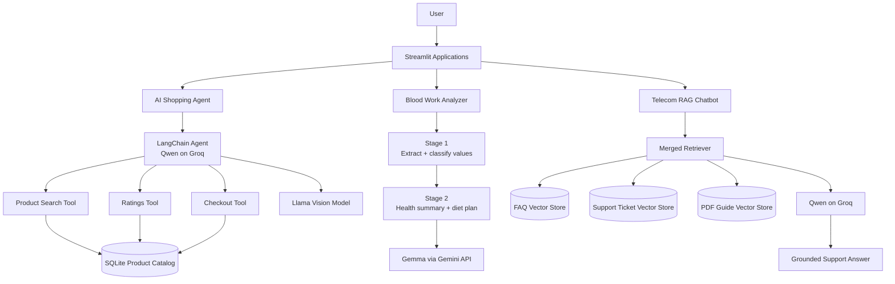
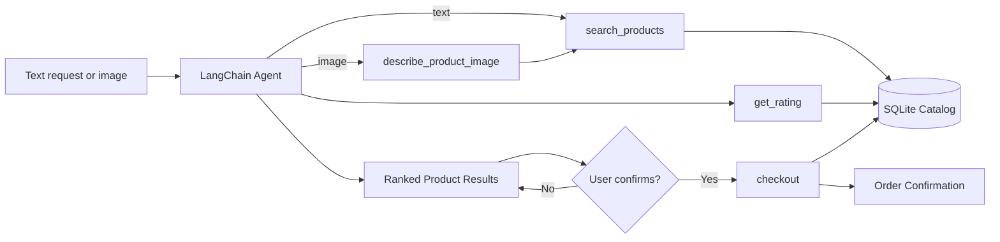
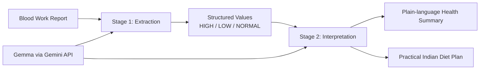
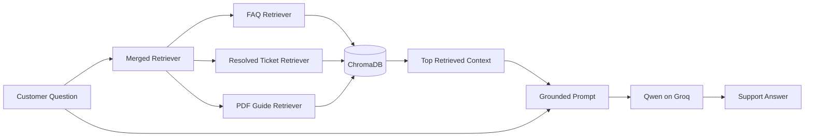

<div align="center">

# Agentic AI Systems Portfolio

### Three end-to-end AI applications I built with agents, multimodal models, RAG, structured LLM pipelines, and production-style interfaces.


**Built by Krishna Rokkam** · [`@chaitanya4595-afk`](https://github.com/chaitanya4595-afk)

</div>

---

## What I built

This repository is a portfolio of AI systems I built end-to-end, from application logic and data flow to model orchestration and user interfaces.

The projects demonstrate:

- **Tool-using AI agents** that decide when to search, retrieve ratings, analyze an image, or execute an action.
- **Multimodal workflows** that convert an uploaded product image into structured search intent.
- **Retrieval-Augmented Generation (RAG)** over multiple knowledge sources using vector search.
- **Multi-stage LLM pipelines** that separate extraction from interpretation instead of relying on one large prompt.
- **Guardrails around actions**, including explicit user confirmation before checkout.
- **Application engineering** with Streamlit, SQLite, ChromaDB, environment-based secrets, and deploy-specific dependencies.

---

## System portfolio



---

# 1. AI Shopping Agent

[`View source →`](ai_shopping_agent/)

A conversational shopping agent that turns natural-language requests or product photos into an executable shopping workflow.

A user can say:

> I want organic honey under $20 with a 4.5+ rating.

The agent searches the catalog, checks ratings for candidates, presents valid products, remembers the product IDs it displayed, and only calls checkout after explicit confirmation.

### Architecture



### What I engineered

- Built four LangChain tools: `search_products`, `get_rating`, `checkout`, and `describe_product_image`.
- Used **Qwen on Groq** as the reasoning model and **Llama 4 Scout** for image understanding.
- Added an explicit confirmation boundary so browsing can never silently trigger checkout.
- Preserved product IDs in conversation state so commands such as `order #2` map back to the correct database record.
- Reused the same product-search pipeline for both text and image input instead of maintaining separate flows.
- Built the interface in Streamlit and the catalog/order layer in SQLite.

**Stack:** Python · LangChain · Groq · Qwen · Llama 4 Scout · SQLite · Streamlit

---

# 2. Blood Work Analyzer

[`View source →`](blood_work_analyzer/)

A two-stage LLM application that converts an unstructured blood-work report into structured test interpretation and a readable dietary summary.

Instead of asking one prompt to do everything, I separated the workflow into **extraction** and **interpretation**.

### Architecture



### What I engineered

- Extracted every reported test value together with its reference range.
- Classified each result as `HIGH`, `LOW`, or `NORMAL` using the report's supplied ranges.
- Fed the structured output into a second model call instead of mixing extraction and explanation in one prompt.
- Split the final model response into independently rendered **Health Summary** and **Suggested Diet Plan** panels.
- Built an editable Streamlit interface with a preloaded example report for demonstration.

**Stack:** Python · LangChain · Gemini API · Gemma · Streamlit

> This project is a technical demonstration and is not a medical diagnosis or substitute for professional medical advice.

---

# 3. Telecom RAG Chatbot

[`View source →`](telecom_rag_chatbot/)

A customer-support assistant that answers telecom questions using retrieved evidence rather than relying only on the model's internal knowledge.

The knowledge layer combines **FAQs, historical support tickets, and a telecom PDF guide**.

### Architecture



### What I engineered

- Built separate ingestion pipelines for CSV FAQ data, SQLite support tickets, and PDF documentation.
- Embedded the sources locally and stored them as Chroma collections.
- Combined retrieval results from all three knowledge sources before generation.
- Added source metadata to retrieved context so the model can reason over where information came from.
- Constrained the assistant to the retrieved context and instructed it to say when the available evidence is insufficient.

**Stack:** Python · LangChain · ChromaDB · Hugging Face embeddings · Groq · Qwen · Streamlit

---

## Repository structure

```text
agentic-ai-projects/
│
├── ai_shopping_agent/
│   ├── app.py                 # Streamlit application
│   ├── shopping_agent.py      # Agent, models, tools, guardrails
│   ├── reviews_api.py         # Rating aggregation
│   ├── setup_db.py            # Product/review database setup
│   ├── store.db               # Demo catalog
│   └── resources/             # Images for multimodal testing
│
├── blood_work_analyzer/
│   ├── blood_work_analysis.ipynb
│   ├── blood_work.txt
│   └── streamlit_app/
│       └── app.py
│
├── telecom_rag_chatbot/
│   ├── app.py
│   ├── rag_chain.py
│   ├── retriever.py
│   ├── ingest_faq.py
│   ├── ingest_tickets.py
│   ├── ingest_pdf.py
│   └── data/
│
├── .env.example
└── README.md
```

---

## Run locally

### 1. Clone

```bash
git clone https://github.com/chaitanya4595-afk/agentic-ai-projects.git
cd agentic-ai-projects
```

### 2. Configure keys

```bash
cp .env.example .env
```

Add the API keys required by the application you want to run.

### 3. Launch an application

**AI Shopping Agent**

```bash
pip install -r ai_shopping_agent/requirements.txt
streamlit run ai_shopping_agent/app.py
```

**Blood Work Analyzer**

```bash
pip install -r blood_work_analyzer/streamlit_app/requirements.txt
streamlit run blood_work_analyzer/streamlit_app/app.py
```

For the Telecom RAG Chatbot, see its [project README](telecom_rag_chatbot/README.md) for the ingestion workflow.

---

## Engineering themes

The common idea across these projects is not simply calling an LLM. I am treating the model as one component inside a larger system:

**input → orchestration → tools/retrieval → model reasoning → validation/action → user-facing output**

That separation is what makes the applications easier to reason about, test, and extend.
