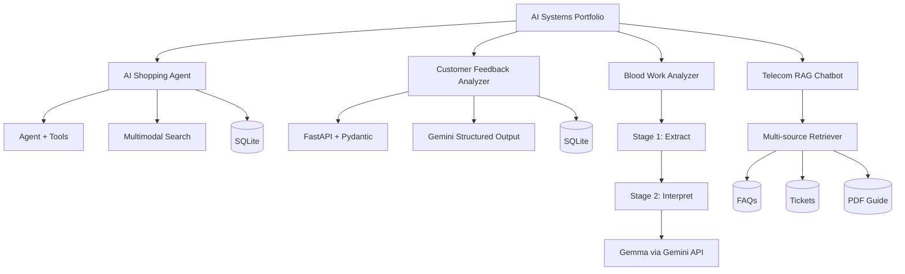

# AI Systems Portfolio

A concise index of end-to-end AI applications I built across **agent orchestration, multimodal workflows, staged LLM pipelines, API-backed analytics, and retrieval-augmented generation**.

The projects are organized as real applications rather than notebook-only experiments: public demos where appropriate, explicit architecture, testable Python components, environment-based secrets, and documented limitations.

## Featured projects

| Project | Live demo | Source | What it demonstrates |
| --- | --- | --- | --- |
| **AI Shopping Agent** | [Launch](https://ai-shopping-agent-fvz8dpwpsfrihivomnkcz2.streamlit.app/) | [Repository](https://github.com/chaitanya4595-afk/ai-shopping-agent) | Tool-calling agent, multimodal search, SQLite tools, guarded demo checkout |
| **Customer Feedback Analyzer** | [Launch](https://customer-feedback-analyzer-748gprrueqgffnaygsoevu.streamlit.app/) | [Repository](https://github.com/chaitanya4595-afk/customer-feedback-analyzer) | Streamlit + FastAPI, Gemini structured output, validation, persistence, failure handling |
| **Blood Work Analyzer** | [Launch](https://blood-work-analyzer-ajxxhudcgayqhcsinv7g9u.streamlit.app/) | [Repository](https://github.com/chaitanya4595-afk/blood-work-analyzer) | Two-stage LLM pipeline, dependency injection, pipeline-contract testing |
| **Telecom RAG Chatbot** | — | [Code in this repo](telecom_rag_chatbot/) | Multi-source RAG over FAQs, support tickets, and PDF documentation |

## If you have 3 minutes

### 1. Start with the AI Shopping Agent

Try:

```text
I want organic honey under $20 with a 4.5+ rating
```

Then reply with `order #1`, or upload a sample product image. The project is the clearest demonstration of agent orchestration because the model must coordinate product search, rating lookup, image understanding, and a write-capable checkout tool.

**Technical signals:** LangChain tools · Qwen on Groq · Llama vision · SQLite · Streamlit · GitHub Actions

[Live demo](https://ai-shopping-agent-fvz8dpwpsfrihivomnkcz2.streamlit.app/) · [README](https://github.com/chaitanya4595-afk/ai-shopping-agent#readme) · [Architecture](https://github.com/chaitanya4595-afk/ai-shopping-agent/blob/main/ARCHITECTURE.md)

### 2. Review the Customer Feedback Analyzer

This project shows a more conventional application architecture: Streamlit calls a FastAPI service, Gemini returns validated structured output, successful analyses can be persisted to SQLite, and failures are handled per review rather than crashing the entire batch.

**Technical signals:** FastAPI · Pydantic · structured LLM output · API contracts · SQLite · pytest

[Live demo](https://customer-feedback-analyzer-748gprrueqgffnaygsoevu.streamlit.app/) · [Repository](https://github.com/chaitanya4595-afk/customer-feedback-analyzer)

### 3. Look at the Blood Work Analyzer for pipeline decomposition

The main design decision is to split one broad LLM task into two stages:

```text
raw report
   ↓
extract + classify
   ↓
intermediate representation
   ↓
interpret
   ↓
summary + diet guidance
```

The service accepts an injected model dependency, allowing the orchestration contract to be tested without making external model calls.

**Technical signals:** staged LLM workflow · prompt contracts · dependency injection · failure handling · CI

[Live demo](https://blood-work-analyzer-ajxxhudcgayqhcsinv7g9u.streamlit.app/) · [README](https://github.com/chaitanya4595-afk/blood-work-analyzer#readme) · [Architecture](https://github.com/chaitanya4595-afk/blood-work-analyzer/blob/main/ARCHITECTURE.md)

## Portfolio map



## Engineering themes across the portfolio

Rather than treating the model as the entire application, these projects repeatedly separate responsibilities:

```text
user input
   ↓
application / orchestration layer
   ↓
deterministic tools, retrieval, or structured intermediate state
   ↓
model reasoning or generation
   ↓
validation / guarded action
   ↓
user-facing output
```

That separation creates concrete places to test, validate, observe, and harden the system.

## What I would harden next

The projects are portfolio-scale systems, not claims of production completeness. The next layer across the portfolio would be:

- structured-output schemas wherever free-form model text is still used
- end-to-end evaluation datasets and regression tests
- tracing, latency, token, and failure telemetry
- application-level authorization for write-capable agent tools
- hosted production data stores where SQLite is currently used
- stronger document parsing and deterministic validation before LLM interpretation

The Telecom RAG project remains in this repository as a working build and has not yet been promoted to a standalone deployed application.
