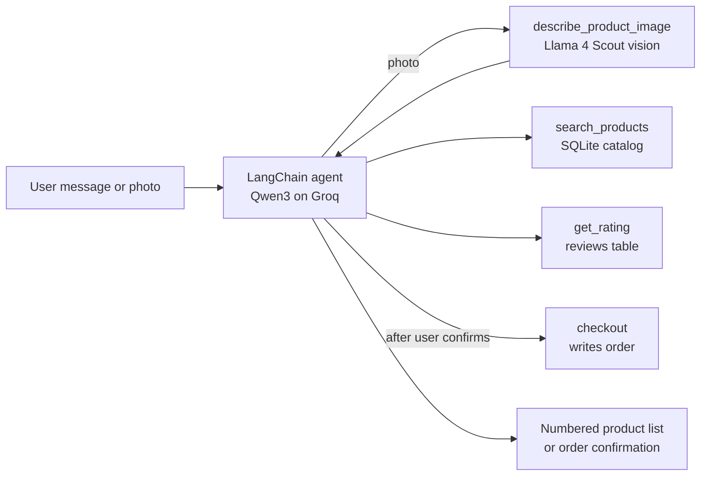

# AI Shopping Agent

> **Historical tutorial snapshot.** The current project is [kcrokkam/ai-shopping-agent](https://github.com/kcrokkam/ai-shopping-agent). Use that repository for setup, documentation, and future changes.

[Portfolio guide](../README.md)

A conversational shopping assistant. Tell it what you want in plain English, or upload a photo of a product. It searches the store, checks customer ratings, shows the matches, and places the order once you confirm.

## How it works



The agent chooses among four tools:

| Tool | What it does |
|---|---|
| `search_products` | Keyword search over name, description and category, with optional max-price and organic filters |
| `get_rating` | Average rating and review count for a product |
| `checkout` | Places an order and returns an order ID |
| `describe_product_image` | Sends the photo to a vision model and returns a search query and organic flag |

## Design decisions

- **Orders need explicit confirmation.** The system prompt forbids calling `checkout` while browsing. The agent lists products first and orders only after the user says yes or picks a number.
- **No guessed product IDs.** Every listed product carries its `(ID:X)`, and the agent must take the ID from its own previous message. This keeps "order #2" mapped to the right product.
- **Image search reuses the text flow.** The vision model turns a photo into the same search inputs a typed request would produce, so both paths share one pipeline.
- **Works on Groq's free tier.** The chat model's output is capped at 900 tokens, below the free tier's output-tokens-per-minute limit.

## Files

| File | Purpose |
|---|---|
| `app.py` | Streamlit chat UI with a shop-by-image sidebar |
| `shopping_agent.py` | Tools, models and agent definition |
| `reviews_api.py` | Rating aggregation over the reviews table |
| `setup_db.py` | Builds `store.db` with 32 products and their reviews |
| `resources/` | Sample product photos for trying the image search |

## Run locally

```bash
uv run streamlit run ai_shopping_agent/app.py
```

Needs `GROQ_API_KEY` in `.env` at the repo root. Rebuild the database with `uv run python ai_shopping_agent/setup_db.py`.
